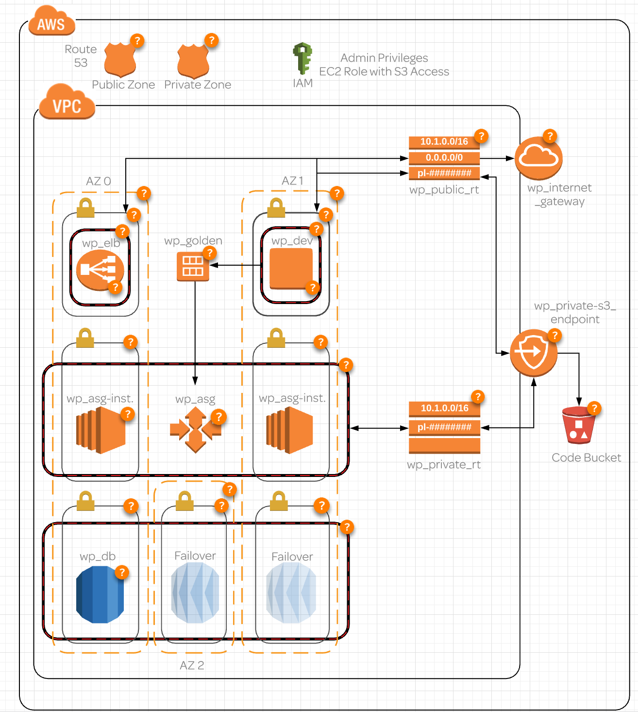
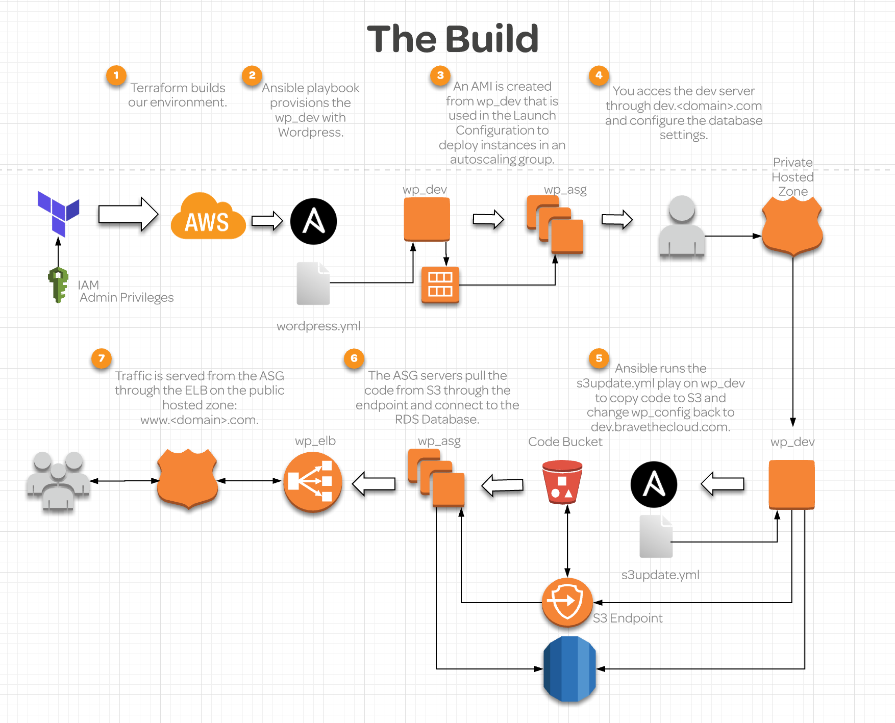

# Deploying to AWS with Ansible and Terraform

This is a terraform and ansible IaC example that deploys the infrastructure below.

The high level process is as follows:

# Packages used:

## ansible 2.8.5
## terraform 0.12

# How to execute

You will need an ssh-key generated to be able to allow the script to deploy to your aws instance.

Clone the repo to your local machine and cd into the directory.
Execute `terraform init` for initial setup, 
followed by `terraform plan` which will display information about the deployment.
If all looks good execute the deployment with the command `terraform apply`.

To terminate the infrastructure that was deployed execute the comman `terraform destroy`

